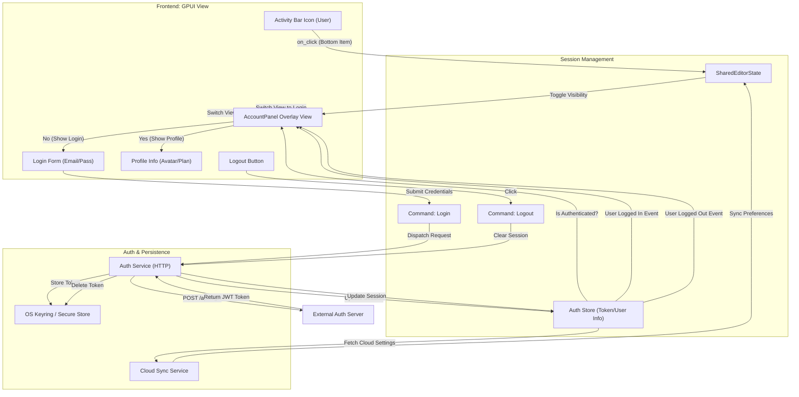

# Account Activity Flow

This document details the frontend-to-backend transition flow for the Account activity, managing user authentication and cloud settings.

## Overview

The Account activity (Bottom Item 'User') provides a modal for login, registration, and profile management.

## Transition Diagram

## Component Details

### Frontend Components
*   **AccountPanel:** Overlay container.
*   **Login Form:** Inputs for email/password or OAuth buttons.
*   **Profile View:** Displays user avatar, name, and subscription tier (Free/Pro).

### State & Backend
*   **Auth Store:** Holds the current user's session state in memory.
*   **Auth Service:** Handles communication with the Luminara backend (e.g., Supabase/Firebase/Custom).
*   **Keyring:** Securely stores the refresh token on the user's OS keychain to persist login across sessions.
*   **Cloud Sync:** Synchronizes editor settings (theme, keybindings) to the cloud upon login.
