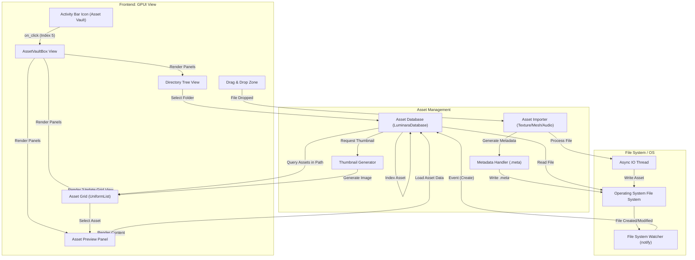

# Asset Vault Activity Flow

This document details the frontend-to-backend transition flow for the Asset Vault activity, the central repository for project resources.

## Overview

The Asset Vault (Activity Index 5) allows managing project files, importing assets, and organizing folder structures.

## Transition Diagram

## Component Details

### Frontend Components
*   **AssetVaultBox:** Main container.
*   **File Tree:** Collapsible directory structure of the project assets folder.
*   **Asset Grid:** Virtualized grid displaying asset thumbnails. Supports drag-and-drop.
*   **Preview Panel:** Shows details (metadata, image preview, model viewer) of the selected asset.

### Services & Backend
*   **Asset Database:** Indexes all assets, managing UUIDs and metadata.
*   **File System Watcher:** Monitors disk changes to keep the database in sync with external modifications.
*   **Asset Importer:** Converts raw files (e.g., .png, .obj) into engine-ready formats or simply copies them.
*   **Thumbnail Generator:** Creates visual representations for assets (e.g., downscaled textures, model snapshots).
