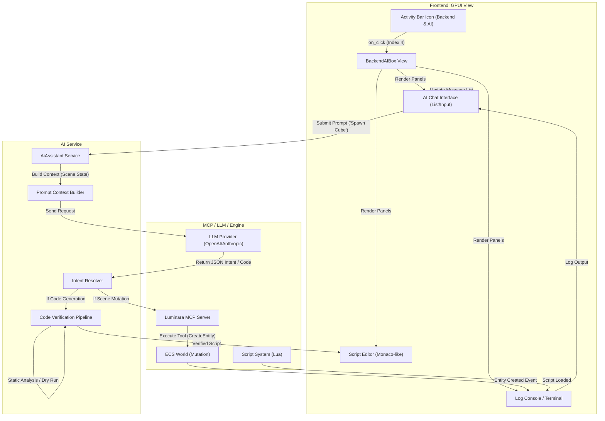

# Backend & AI Activity Flow

This document details the frontend-to-backend transition flow for the Backend & AI activity, the hub for scripting and AI-assisted development.

## Overview

The Backend & AI activity (Activity Index 4) integrates code editing, terminal access, and the AI Copilot.

## Transition Diagram

## Component Details

### Frontend Components
*   **BackendAIBox:** Main container.
*   **Chat Interface:** Conversational UI for interacting with the AI Agent.
*   **Script Editor:** Syntax-highlighted text editor for manual or AI-generated code.
*   **Console:** Displays engine logs, script errors, and AI thought processes.

### Services & Backend
*   **AiAssistant:** Manages the conversation history and API communication.
*   **Intent Resolver:** Parses the LLM's response into actionable commands (e.g., `SpawnRelative`, `ModifyComponent`).
*   **MCP Server:** Exposes engine tools (Scene, FileSystem) to the AI model in a structured way.
*   **Code Verification:** Ensures generated scripts are safe and syntactically correct before execution.
