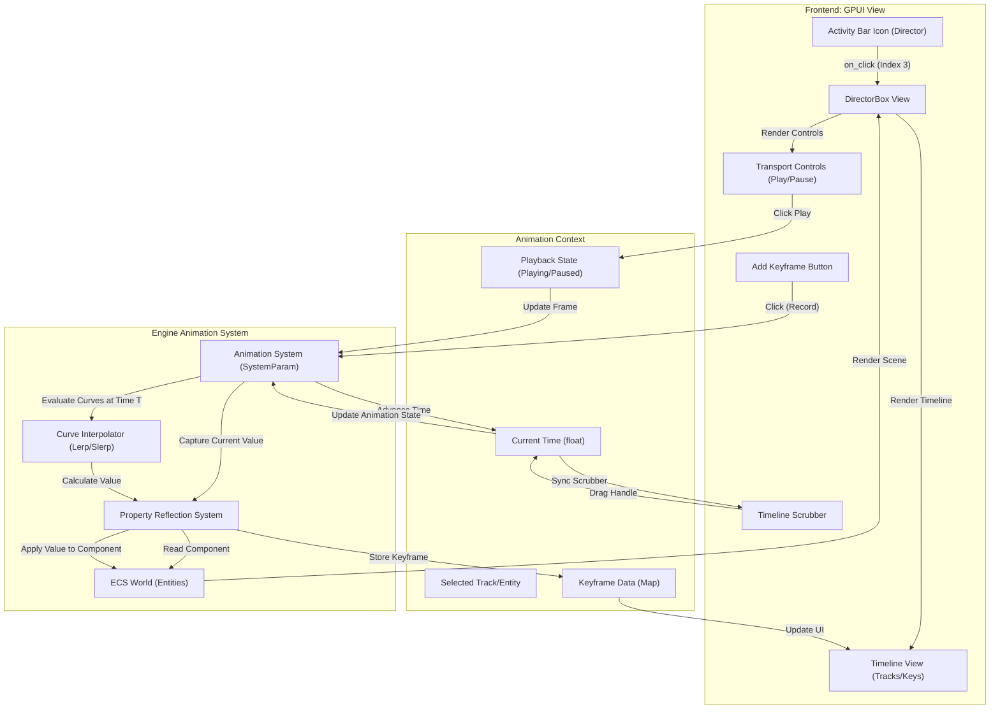

# Director Activity Flow

This document details the frontend-to-backend transition flow for the Director activity, used for creating cinematic sequences and animations.

## Overview

The Director activity (Activity Index 3) provides a timeline interface for animating entity properties over time.

## Transition Diagram

## Component Details

### Frontend Components
*   **DirectorBox:** Main container.
*   **Timeline:** Visualizes animation tracks and keyframes. Supports zooming and panning.
*   **Transport Controls:** Standard media controls (Play, Pause, Stop, Loop).
*   **Scrubber:** Interactive element to seek to a specific time.

### State & Backend
*   **Animation System:** Manages the playback loop and time synchronization.
*   **Keyframe Data:** Stores time-value pairs for properties (Position, Rotation, Opacity, etc.).
*   **Curve Interpolator:** Calculates intermediate values between keyframes (Linear, Bezier, etc.).
*   **Property Reflection:** Allows the animation system to read/write arbitrary component fields dynamically.
