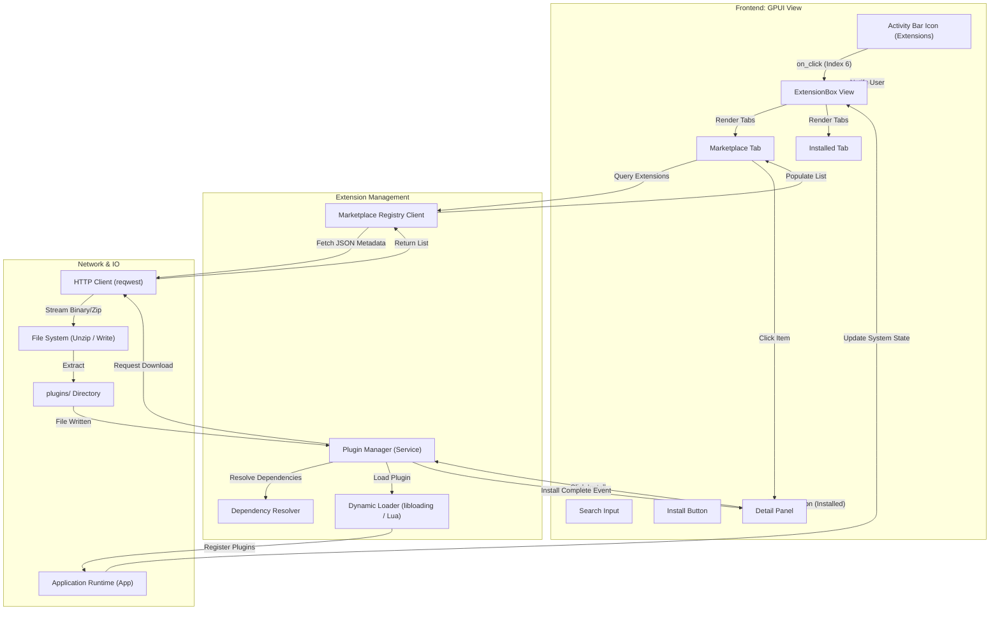

# Extensions Activity Flow

This document details the frontend-to-backend transition flow for the Extensions activity, managing editor plugins and add-ons.

## Overview

The Extensions activity (Activity Index 6) allows users to browse, install, and manage plugins from the Luminara Marketplace.

## Transition Diagram

## Component Details

### Frontend Components
*   **ExtensionBox:** Main container.
*   **Marketplace Tab:** Lists available extensions from the remote registry.
*   **Installed Tab:** Lists locally installed extensions.
*   **Detail Panel:** Shows description, version, and dependencies of a selected extension.

### Services & Backend
*   **Plugin Manager:** Core service for handling the lifecycle (Install, Enable, Disable, Uninstall) of extensions.
*   **Registry Client:** Communicates with the online extension marketplace API.
*   **Dynamic Loader:** Responsible for safely loading compiled plugins (`.dll`/`.so`) or script packages (`.lua`) into the running editor.
