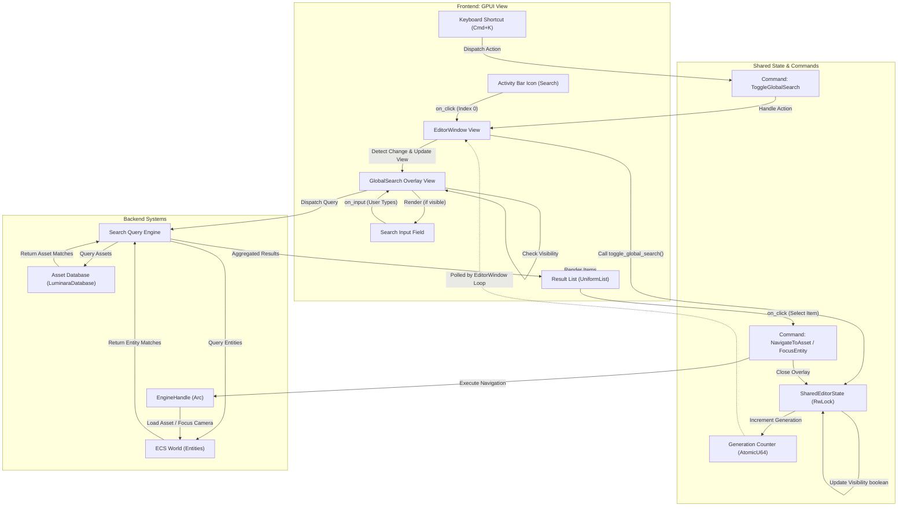

# Global Search Activity Flow

This document details the frontend-to-backend transition flow for the Global Search activity, triggered via the Activity Bar or keyboard shortcut (Cmd+K).

## Overview

The Global Search feature acts as an overlay on top of the current editor view, allowing users to quickly find assets, entities, and commands.

## Transition Diagram

## Component Details

### Frontend Components
*   **Activity Bar Icon:** Located at index 0. Triggers `toggle_global_search` on the `EditorWindow`.
*   **GlobalSearch View:** An overlay component (`crates/luminara_editor/src/features/global_search`) that renders the search bar and results list.
*   **Input Field:** Captures user keystrokes and debounces queries.
*   **Result List:** Uses `gpui::uniform_list` for virtualized rendering of search results.

### State & Backend
*   **SharedEditorState:** Manages the visibility state of the global search overlay across threads.
*   **LuminaraDatabase:** The backend database for asset metadata indexing.
*   **ECS World:** The active game world, queried for runtime entities matching the search term.
