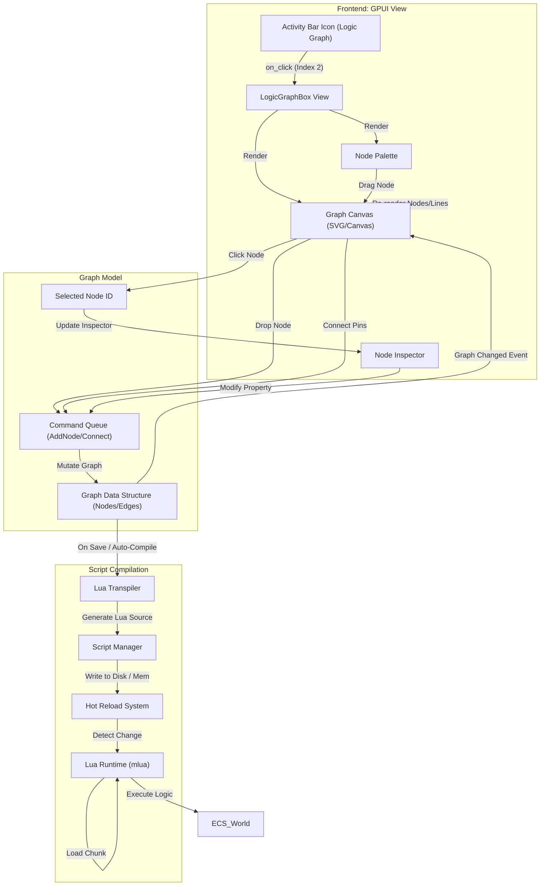

# Logic Graph Activity Flow

This document details the frontend-to-backend transition flow for the Logic Graph activity, used for visual scripting.

## Overview

The Logic Graph provides a node-based interface (Activity Index 2) to program game logic without writing code directly. It transpiles to Lua.

## Transition Diagram

## Component Details

### Frontend Components
*   **LogicGraphBox:** Container for the node editor interface.
*   **Canvas:** Renders nodes and connections. Handles mouse events for panning, zooming, and wiring.
*   **Palette:** List of available logic nodes (Events, Actions, Variables).

### State & Backend
*   **Graph Data Structure:** An in-memory representation of the visual graph (Nodes, Pins, Edges).
*   **Lua Transpiler:** Converts the graph structure into valid Lua code (e.g., `function on_update(dt) ... end`).
*   **Hot Reload System:** Monitors the generated script files and reloads the Lua VM state without restarting the editor.
