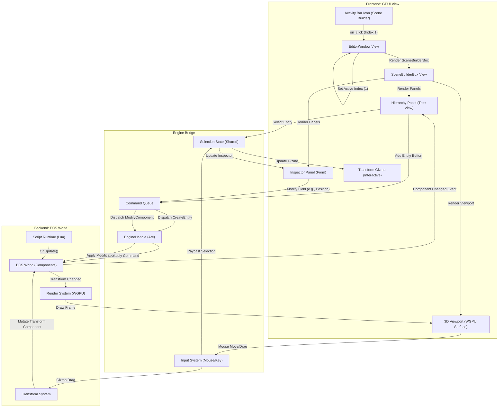

# Scene Builder Activity Flow

This document details the frontend-to-backend transition flow for the Scene Builder activity, the primary interface for world construction.

## Overview

The Scene Builder is the default view (Activity Index 1) and provides a 3D viewport, hierarchy tree, and component inspector.

## Transition Diagram

## Component Details

### Frontend Components
*   **SceneBuilderBox:** Main container layout.
*   **Hierarchy:** Displays the entity tree using `gpui::list`. It listens for World changes to update the tree structure.
*   **Inspector:** Dynamically generates UI forms based on selected entity components using reflection.
*   **Viewport:** Renders the 3D scene using `wgpu` integration within a GPUI element.

### Bridge & Backend
*   **EngineHandle:** Provides thread-safe access to the engine's command queue.
*   **SelectionState:** Tracks the currently selected entity ID(s) to synchronize the Hierarchy, Inspector, and Gizmo.
*   **Command Queue:** Buffers mutations (Create, Delete, Modify) to be applied at the start of the next frame to ensure thread safety.
