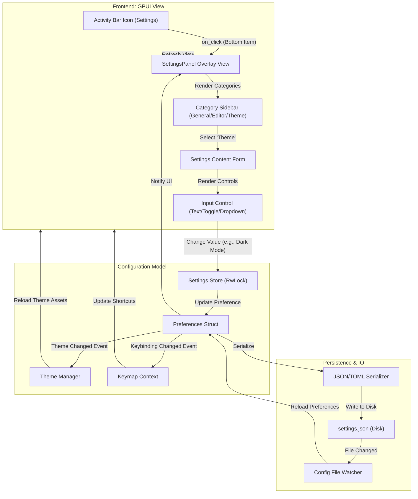

# Settings Activity Flow

This document details the frontend-to-backend transition flow for the Settings activity, managing global editor configuration.

## Overview

The Settings activity (Bottom Item 'Gear') provides a modal overlay for configuring the editor environment, keybindings, and themes.

## Transition Diagram

## Component Details

### Frontend Components
*   **SettingsPanel:** Main overlay container.
*   **Category List:** Sidebar navigation for setting groups (General, Editor, Theme, Keybindings).
*   **Content Area:** Displays the specific controls for the selected category.
*   **Input Controls:** Reusable UI widgets (Checkbox, TextInput, Dropdown) bound to setting values.

### State & Backend
*   **Settings Store:** Centralized repository for runtime configuration.
*   **Preferences Struct:** Strongly typed Rust struct representing the configuration schema.
*   **Serializer:** Handles reading/writing the configuration to disk (JSON/TOML).
*   **Theme Manager:** Applying color schemes to the UI in real-time.
